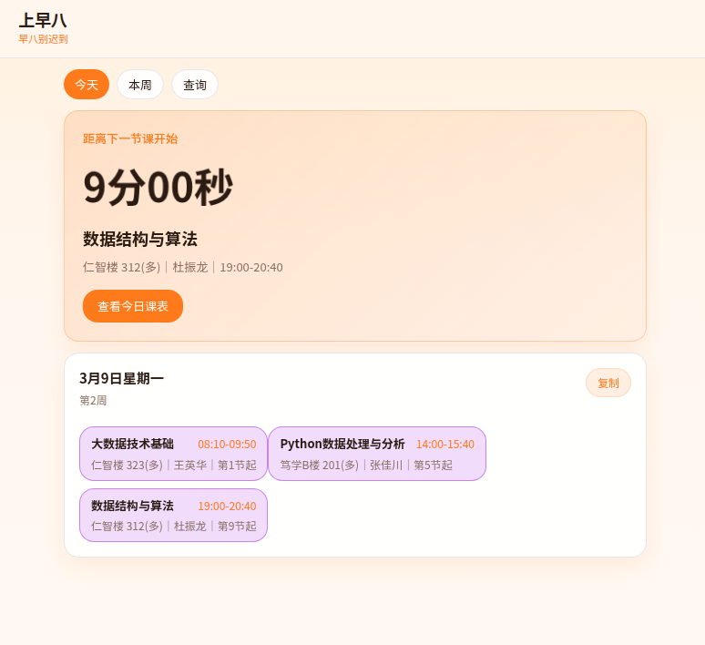
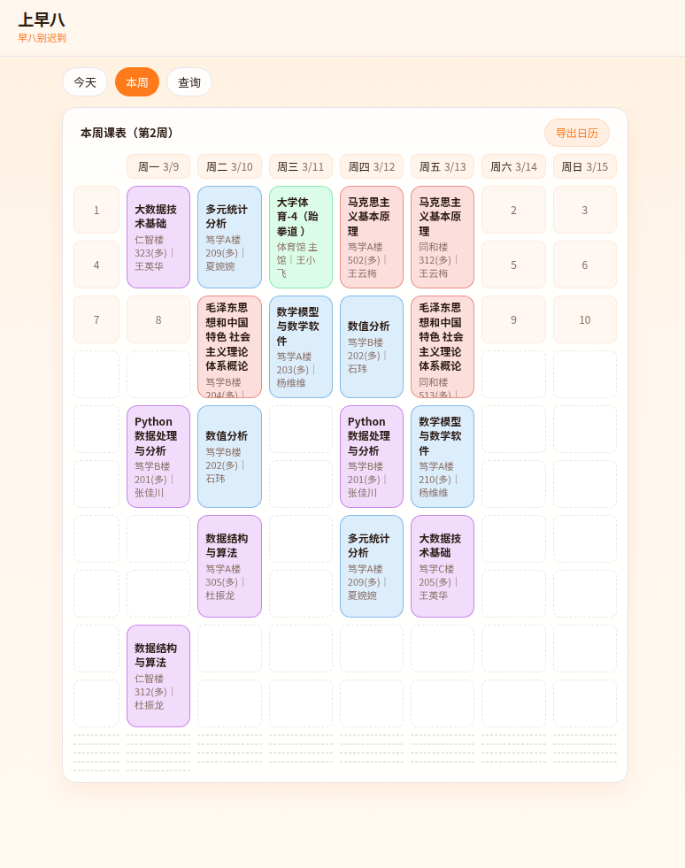
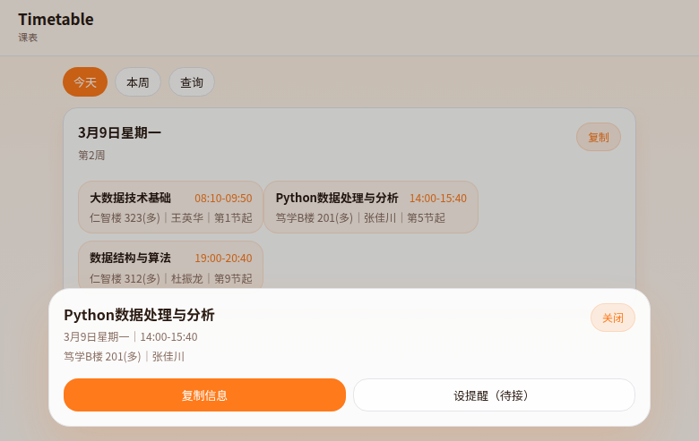

# 上早八（timetable/web）

一个面向学生的课表 App（Web 版），核心目标：**下一节课别迟到**。

## 功能

- **今天**：下一节课倒计时（含轻微呼吸动效）+ 今日课程卡片
- **本周**：1-10 节周视图网格（课程按科目/课程名稳定配色）+ 点击课程弹出详情抽屉
- **导出日历**：本周 `.ics` 下载（可导入系统日历/Google 日历/Outlook）
- **提醒**：开课前 **10 分钟提醒**（浏览器通知；本地持久化，可取消）

> 说明：浏览器通知是否能“后台准点提醒”取决于平台能力。要做到真正的安卓后台本地通知，建议配合 Capacitor/原生壳。

## 截图

### 今天（倒计时 + 今日课表）



### 本周（周视图网格 + 导出日历）



### 课程详情抽屉



## 数据源

默认读取：

- `https://raw.githubusercontent.com/Health-525/timetable/main/data/schedule.json`

可通过环境变量覆盖（服务端优先）：

```bash
cp .env.local.example .env.local
```

```env
# 服务端优先（推荐）：不会暴露到浏览器 bundle
SCHEDULE_URL=https://your-domain.com/schedule.json

# 兼容：如需在浏览器端使用也可保留（会暴露到客户端）
NEXT_PUBLIC_SCHEDULE_URL=https://your-domain.com/schedule.json
```

## 本地运行

```bash
npm install
npm run dev -- --port 3003
# http://127.0.0.1:3003/
```

## 安卓适配（Capacitor）

当前已生成安卓工程：`web/android/`。

- `capacitor.config.ts`：appName/appId/webDir 等配置
- `dist/index.html`：Capacitor webDir 的占位入口（后续可替换为真正的构建产物，或在开发阶段用 server.url 加载 dev server）

开发阶段（真机测试最快）：建议配置 `server.url` 指向同网段可访问的 dev server（如 `http://<LAN-IP>:3003`），然后用 Android Studio 运行。

## 目录结构（简）

- `app/components/TimetableApp.tsx`：主 UI（今天/本周/查询）
- `lib/schedule.ts`：数据结构与计算（周次、过滤、格式化）
- `lib/load-schedule.ts`：拉取课表 JSON（带超时、健壮解析）
- `lib/ics.ts`：生成周课表 ICS

## 隐私

- 前端仅拉取 JSON 并在本地渲染。
- 不要把原始课表 PDF 放到公网（可能含个人信息）。
